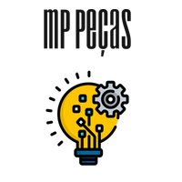

# Desafios Beca (NTT DATA Europe & LATAM).
# Monique Parente  | Categoria: Desenvolvedora Jr. 
# Mentor: Flavius Gama.

______________________________________________________________________________________________________________________________________________________________________________

  

# Sumário

* Seja Bem-Vindo(a)!!

✨ [Desafio 1](https://github.com/MoniqueParente/DesafiosBecaMoniqueParente/blob/features-modificacao/README.md) 

✨ [Desafio 2](https://github.com/MoniqueParente/DesafiosBecaMoniqueParente/blob/feature-desafio2/README.md) 

✨ [Desafio 3](https://github.com/MoniqueParente/DesafiosBecaMoniqueParente/blob/feature-desafio3/README.md) 

✨ [Desafio 4](https://github.com/MoniqueParente/DesafiosBecaMoniqueParente/blob/feature-desafio4/README.md) 

✨ [Desafio 5](https://github.com/MoniqueParente/DesafiosBecaMoniqueParente/blob/feature-desafio5/README.md) 

✨ [Desafio 6](https://github.com/MoniqueParente/DesafiosBecaMoniqueParente/blob/feature-desafio6/README.md) 

✨ [Desafio 7](https://github.com/MoniqueParente/DesafiosBecaMoniqueParente/blob/feature-desafio7/README.md) 

✨ [Desafio 8](https://github.com/MoniqueParente/DesafiosBecaMoniqueParente/blob/feature-desafio8/README.md) 

Curso recomendado: 

- [Curso Cod3r - Udemy](https://nttdatalearn.udemy.com/course/fundamentos-de-programacao-com-java/learn/lecture/5740792#announcements) 

______________________________________________________________________________________________________________________________________________________________________________

✅ Ferramentas.

📌 Draw.io - Aplicar UML

📌 Postman - Simulação de Interface.

📌 H2 - Banco de Dados.

📌 IDE: InteliJ

📌 Linguagem de Programação: 

  
✅ Frameworks.

* Spring Boot. 
* JPA.
* Lambdas.
* JDBC.
* JSON.
* Swagger.

______________________________________________________________________________________________________________________________________________________________________________
